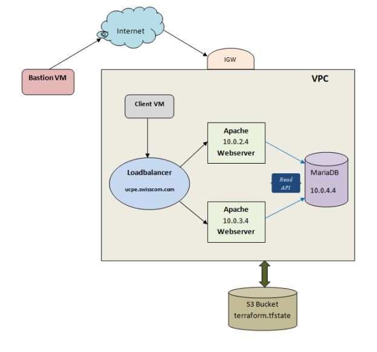

## uCPE-tf-ansible-aws-project

Using Terraform as IaC and Ansible for the configuration management, I designed and implemented the following solution:
- On top of AWS, I deployed a VPC in which are residing four EC2 instances and an Application Loadbalancer;
- One EC2 instance is used as the client, the other two instances are two identical Apache servers connected to a third EC2 instance which represents the SQL server (MariaDB-server)
- Each of the four EC2 instances are in their own subnet;
- The Application Loadbalancer sits in front of the two Apache servers, distributing the client requests sequentially to the Web servers;
- The Web servers are capable to REST call data from the SQL db;
- The servers were scanned for possible software vulnerabilities and the fixes required were applied;
- The Loadbalancer responds to a custom URL;
- The CI was done using GitHub actions; 

### Assumptions

- Virtualization solution: AWS
- OS on the severs is Amazon Linux 2
- Loadbalancer is an AWS Application Loadbalancer
- The Loadbalancer listener can be setup on port 80 TCP
- IaC tool: Terraform
- SQL server: MariaDB-server
- DB and table have to be setup on the SQL server
- Servers have specific private IP addresses 
- Predefined hosts file
- Vulnerability check tool: OSCAP
- The Bastion VM is connected remote to the environment

### Project diagram

### Prerequisites 

##### Bastion:

* CentOS 7 or Ubuntu 20.04 LTS
* Terraform 0.12.29
* Ansible
* wget
* unzip
* git
* python3-pip
* boto3
* awscli

##### AWS account:

* IAM user with necessary rights
* S3 bucket
* t2.micro flavor
* AMI 2 OS image

##### GitHub account:

Secrets for :
 * AWS_ACCESS_KEY_ID
 * AWS_SECRET_ACCESS_KEY
 * Private SSH KEY
 * Public SSH KEY

### Implementation summary

##### Infrastructure deployment

From a remote bastion VM, with access to an IAM user, Terraform deploys the whole AWS VPC infrastructure, using as backend a precreated S3 bucket where the terraform state file is stored: VPC, IGW, subnets, security groups, routing table, Application Loadbalancer, listener, target groups, EC2 instances, private hosted zone etc.

##### Configuration management

Using Terraform's local-exec provisioner, Ansible starts the configuration of four EC2 instances: client, two Apache Webservers and the MariaDB Server. Also, Ansible prepares the vulnerabilty check tool for scanning and implementing mitigations.

##### OpenSCAP

OpenSCAP provides a tool for software vulnerabilty check and mitigation implementation. The following packages have been installed on all servers:

*openscap-scanner
scap-security-guide*

OSCAP tool provides different security profiles depending on the operating system. The profile used for evaluating the servers is *Standard System Security Profile for Amazon Linux 2*. After evaluation, a fix is generated for each server as an Ansible playbook and using GitHub SSH actions is applied.

##### Loadbalancer

The Loadbalancer implemented is an AWS object of type Application Loadbalancer that operates at the application layer and it is the single point of contact between the client and Webservers. It uses a HTTP listener on port 80. 
As it is created, it has its own unique DNS name from AWS, but a custom Alias record was created at VPC level in order to be reached using *ucpe.swisscom.com*.

##### Webservers

There are two Apache Webservers, with PHP7.2 backend, having identical configuration. Using a browser or a tool like *curl* , they will respond through Loadbalancer sequentially. This can be tested using the Loadbalancer address from the client instance. Example:

`curl ucpe.swisscom.com`

##### SQL server

The SQL server is a MariaDB server, on which the following have been created, in order to test the functionality:
* database user: ucpeuser (and related password)
* database name: ucpedb
* database table: todo_list (with 4 elements)
Example:
`MariaDB [(none)]> SELECT * FROM ucpedb.todo_list;`

    |---------|-----------------|
    | item_id | content         |
    |---------|-----------------|
    |       1 | Get interviewed |
    |       2 | Get the job     |
    |       3 | Do the job      |
    |       4 | Love it         |
    |---------|-----------------|

The Ansible playbooks for the MariaDB configuration are based on the following GitHub repository, which I forked and adapted for this project:

[ansible-role-mariadb.git](https://github.com/bertvv/ansible-role-mariadb)

##### REST API

On webservers there is REST API implementation for SQL server, which was forked from the following GitHub repository:

[php-crud-api.git](https://github.com/mevdschee/php-crud-api)

By calling a GET from the client instance towards Webservers, a read response is given from the SQL server:

`curl ucpe.swisscom.com/api.php/records/todo_list/`

    {"records":[{"item_id":1,"content":"Get interviewed"},{"item_id":2,"content":"Get the job"},{"item_id":3,"content":"Do the job"},{"item_id":4,"content":"Love it"}]}

##### GitHub CI

The automation of the whole project was performed using GitHub CI implementation, with several GitHub actions.
The workflow for the CI pipeline is composed of two jobs (terraform-up, terraform-down) and runs on ubuntu-latest version of GitHub provided runners. The terraform-up job is applying the whole configuration only on a push to master branch. On pull requests is just reaching the planification step.
In order to destroy the whole configuration, a pull request with label *"aws down"* is needed.

##### Connecting to client instance

In order to access the client instance inside the VPC from the bastion VM, a Terraform output variable for its public IP is available in the GitHub CI workflow output.
